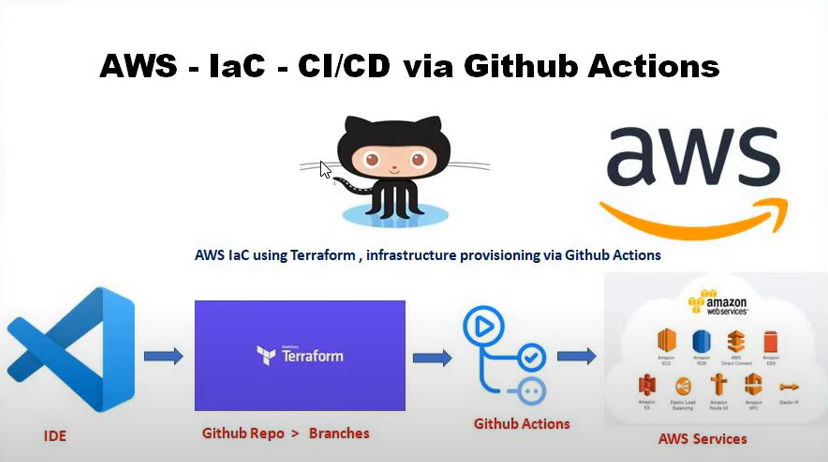
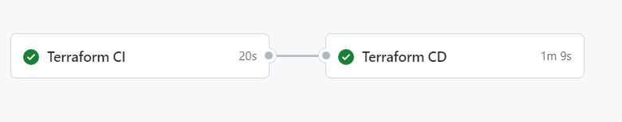

## Github Actions method - CI/CD

### Hello World web server - using terraform to deploy from Github Actions
Pre-requisite: Add AWS credentials into the Github repository's Actions secrets and variables.
1. Create a workflow yaml file under .github/workflows
2. Define CI and CD jobs in the workflow.
3. Once the workflow yaml file is pushed to github repository, it will trigger the running to execute the jobs.

4. Basiclaly the runner wouild execute the terraform code and deploy the AWS EC2.