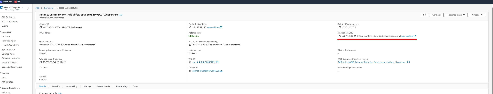

## AWS Console method 

### Hello World web server
1. Go to AWS Console
2. EC2
3. Launch Instance
4. Give a name, default quickstart, instance type(t2 micro), key pair(optional)
5. Network settings, create security group, allow ssh, https(optional for this example), http traffic from internet. 


6. User data:
```
#!/bin/bash
# Use this for your user data (script from top to bottom)
# install httpd (Linux 2 version)
yum update -y
yum install -y httpd
systemctl start httpd
systemctl enable httpd
echo "<h1>Hello World from $(hostname -f)</h1>" > /var/www/html/index.html

```
7. Now "Launch Instance"
8. Wait for instance status change to "Running".
9. Select the instance and check for public IPv4 DNS, copy the address, and open a broweser and open http://<publich IPv4 DNS of the instance>

10. (Optional) Connect -> EC2 Instance Connect -> connect to the instance via ssh. Run systemctl status httpd to check the apache webserver status.
11. Clean up EC2, select instance -> Instance state -> Terminate instance

---
## Reference
https://aws.amazon.com/ec2/getting-started/

https://www.geeksforgeeks.org/create-an-ec2-instance-with-ec2-user-data-script-to-launch-website/
