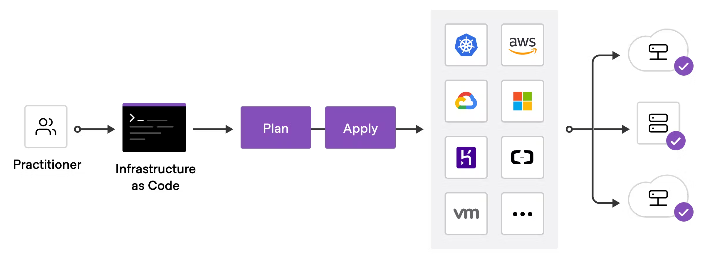
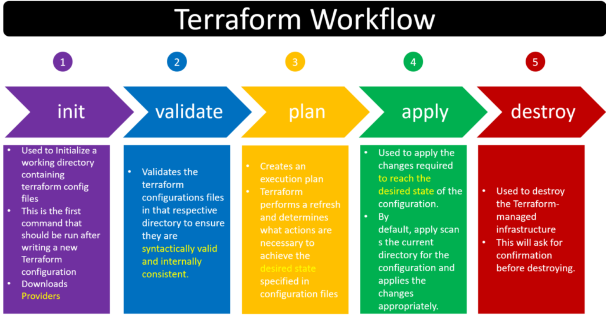

## Terraform method - Infrastructure as a code

### Hello World web server - using terraform to deploy from local
1. Install terraform. https://developer.hashicorp.com/terraform/tutorials/aws-get-started/install-cli
2. Install AWS CLI. https://docs.aws.amazon.com/cli/latest/userguide/getting-started-install.html
3. Authentication with AWS CLI.
4. Create terraform configuration file - provider.tf to have the aws provider set, and properly authenticated.
5. Create a main.tf to define EC2, security group configuration.
6. Run terraform workflow - terraform init/validate/plan/apply/destroy.

---
## reference
https://registry.terraform.io/providers/hashicorp/aws/latest/docs
https://spacelift.io/blog/terraform-ec2-instance
